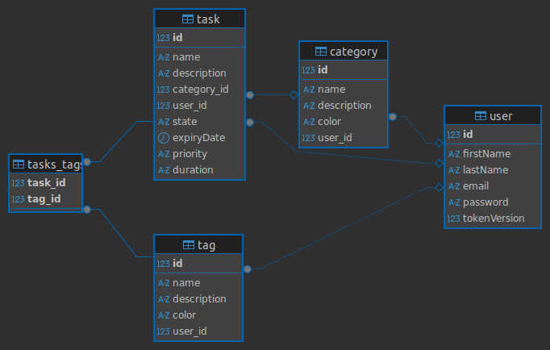

# 📝 Taskcy API

This is a RESTful API for managing tasks, categories, and tags, built with **TypeORM**, **Express**, and **PostgreSQL**. It includes user authentication and supports per-user data isolation.

## 📦 Features

- ✅ User registration and login (JWT-based authentication)
- ✅ Task management (CRUD + mark as complete)
- ✅ Custom categories and tags
- ✅ Authenticated routes per user
- ✅ Auto-generated API documentation at `/docs`

---

## 📚 API Endpoints

### 🔐 Authentication

| Method | Endpoint                  | Description                       |
|--------|---------------------------|-----------------------------------|
| POST   | `/api/auth/register`      | Register a new user               |
| POST   | `/api/auth/login`         | Log in and receive a JWT token    |
| GET    | `/api/auth/profile`       | Get the currently logged-in user  |
| POST   | `/api/auth/refresh-token` | Refresh the JWT token             |

---

### ✅ Tasks

| Method | Endpoint                        | Description                              |
|--------|---------------------------------|------------------------------------------|
| GET    | `/api/tasks`                    | Get all tasks for the authenticated user |
| POST   | `/api/tasks`                    | Create a new task                        |
| PUT    | `/api/tasks/:id`                | Update a task                            |
| DELETE | `/api/tasks/:id`                | Delete a task                            |
| PATCH  | `/api/tasks/:id/completar`      | Toggle task completion                   |

---

### 📂 Categories

| Method | Endpoint                  | Description                        |
|--------|---------------------------|------------------------------------|
| GET    | `/api/categories`         | Get all categories of the user     |
| POST   | `/api/categories`         | Create a new category              |
| PUT    | `/api/categories/:id`     | Update a category                  |
| DELETE | `/api/categories/:id`     | Delete a category                  |

---

### 🏷️ Tags

| Method | Endpoint                | Description                        |
|--------|-------------------------|------------------------------------|
| GET    | `/api/tags`             | Get all tags for the user          |
| POST   | `/api/tags`             | Create a new tag                   |

---

## 🗂️ Database Schema

You can find the database schema in the image below:



## ⚠️ Migration errors

If you encounter errors when running migrations, temporarily add the following line **inside `compilerOptions`** in your **tsconfig.json**:

```json
"types": ["node"]
```

After the migration has completed successfully, remove this line.

---

## 🚀 Getting Started

### 📋 Requirements

- Node.js (v18+ recommended)
- PostgreSQL
- Yarn or npm

### 🔧 Installation

```bash
# Clone the repository
git clone https://github.com/alqae/taskcy-app
cd taskcy-app/server

# Install dependencies
yarn install
```

### ⚙️ Environment Setup

Create a `.env` file in the root with the following variables:

```env
PORT=3000
DB_HOST=localhost
DB_PORT=5435
DB_USER=postgres
DB_PASSWORD=postgres
DB_NAME=taskcy
ACCESS_TOKEN_SECRET=your_jwt_secret_key
REFRESH_TOKEN_SECRET=your_jwt_secret_key
```

> Make sure your PostgreSQL server is running and the database exists.

---

### 🔨 Run the Project

```bash
# Run database migrations
yarn run migration:run

# Start the development server
yarn start
```

The API should now be running at: `http://localhost:3000`

---

## 📖 API Documentation

Interactive API docs are available at:

```
http://localhost:3000/docs
```

Powered by Swagger/OpenAPI.

---

## 📁 Project Structure

```
src/
├── controllers/          # Controllers
├── entities/             # TypeORM entity definitions
├── middlewares/          # Middlewares
├── migrations/           # Migrations
├── routes/               # Routes
├── schemas/              # Schemas
├── utils/                # Utilities
├── config/               # Configuration files
├── data-source.ts        # TypeORM data source configuration
└── index.ts              # App entry point
```
